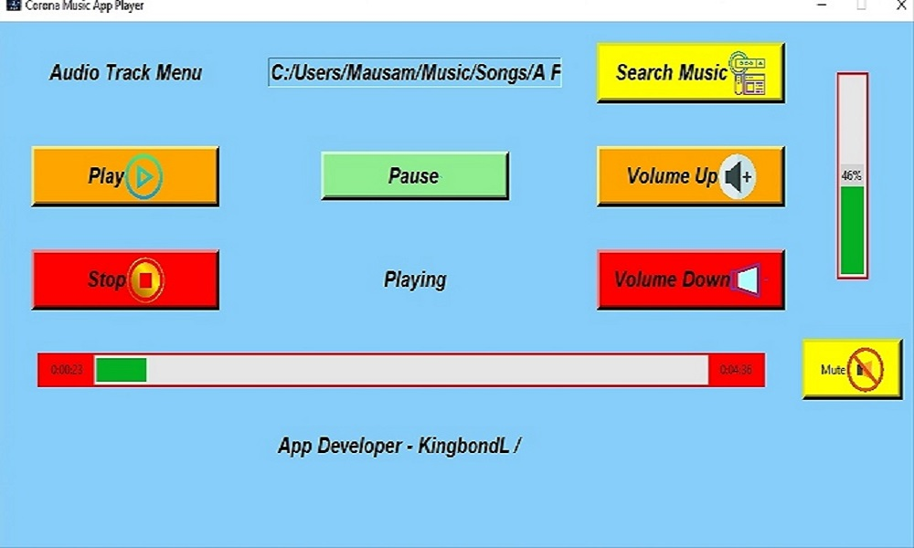

# Corona-Music-App
 Music Application is developed using python and with the helpp of application ,you can play a large range of audio  fromats,including wav,mp3 and numpy arrays.You can also install the .exe file in your windows system for use. There is no need of python to install application
 
 [Download and Install in your windows](https://github.com/Kingbond470/Corona-Music-App/blob/master/KingbondL%20Music%20Player-0.1-amd64.msi)
 
 
 
